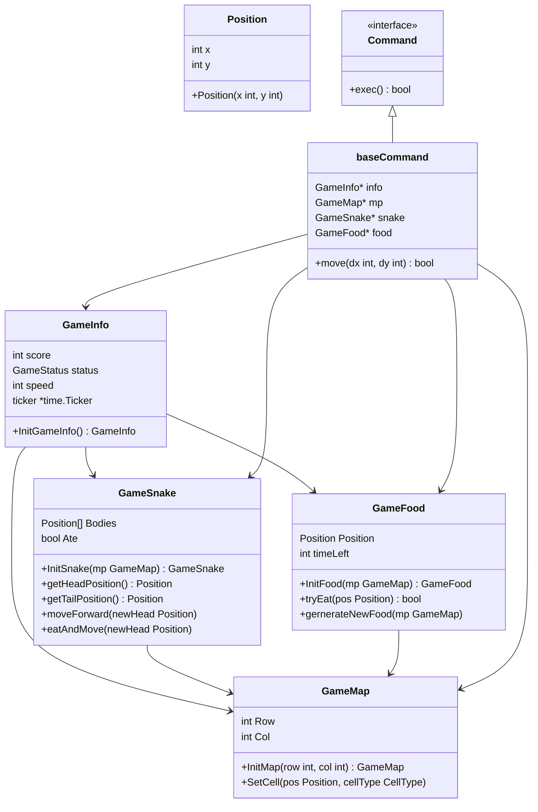

# Go Snake Game

This project is a terminal-based Snake game implemented in Go. It uses the `termbox-go` library for handling terminal input and output.

This document is generated by copilot, so it may have some mistakes.

## Project Structure

```
cell.go
game_commands.go
game_food.go
game_info.go
game_map.go
game_snake.go
go-snake
go.mod
go.sum
key_binding.go
main.go
position.go
```

### Files and Their Responsibilities

- **cell.go**: Manages the individual cells of the game map.
- **game_commands.go**: Defines the commands for moving the snake and handling game logic.
- **game_food.go**: Manages the food items in the game.
- **game_info.go**: Contains the `GameInfo` struct and related functions for managing game state.
- **game_map.go**: Manages the game map.
- **game_snake.go**: Contains the `GameSnake` struct and related functions for managing the snake.
- **go.mod**: Go module file.
- **go.sum**: Go dependencies checksum file.
- **key_binding.go**: Manages key bindings for controlling the snake.
- **main.go**: The main entry point of the application.
- **position.go**: Defines the `Position` struct used for coordinates in the game.

## UML Diagram



## Getting Started

### Prerequisites

- Go 1.23.2 or later
- Terminal that supports `termbox-go`

### Installation

1. Clone the repository:
    ```sh
    git clone https://github.com/yourusername/go-snake.git
    cd go-snake
    ```

2. Install dependencies:
    ```sh
    go mod tidy
    ```

### Running the Game

To start the game, run:
```sh
go run main.go
```

## Game Controls

- **Arrow Keys**: Move the snake in the respective direction.
- **ESC**: Quit the game.

## Dependencies

- [termbox-go](https://github.com/nsf/termbox-go): A library for creating cross-platform text-based interfaces.

## License

This project is licensed under the MIT License.

---

This `README.md` includes a UML diagram generated using Mermaid to visualize the structure and relationships between the main components of the project. Adjust the content as needed to fit your specific project details.